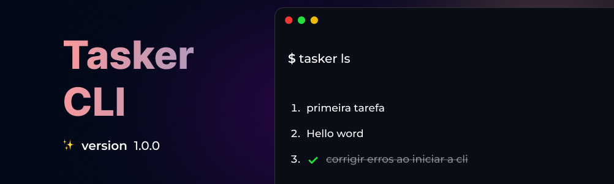

# Tasker

Este é um projeto de CLI (Interface de Linha de Comando) simples utilizando as tecnologias Node.js, SQLite, Commander.js e Chalk.
## 🎯 Objetivos
Estudar um pouco mais node js e sqlite, criando uma cli simples de uma tudo list
## 💻️ Tecnologias utilizadas:
- **node js**
- **Sqlite**
- **chalk**
- **pnpm**
## Instalação
1. Clone o repositório para a sua máquina:
```bash
 git clone https://github.com/seu-usuario/seu-projeto.git
``` 
2. Instale as dependências:
```bash
 pnpm install
```
3. Rode o comando para inicializar a aplicação:
```bash
 pnpm start
```
## Comandos

### Create :

O comando add adiciona um novo item ao banco de dados. Para utilizá-lo, digite:
```bash
 pnpm start cr "Hello word"
```

### List :
O comando **list / ls** lista as tarefas do banco de dados.<br/> Para utilizá-lo, digite:
```bash
=================================== 
        LISTA DE TAREFAS 
===================================

1. primeira tarefa

2. nova tarefa

3. ✔️ corrigir erros ao iniciar a cli

4. Hello word
```

### Delete :
O comando **delete / dl** deleta uma tarefa do banco de dados utilizando seu **id**. <br/>Para utilizá-lo, digite:
```bash
   pnpm start delete 2
```


### Mark :
O comando **mark / mk** marca uma tarefa como completa utilizando seu **id**.<br/>Para utilizá-lo, digite:
```bash
   pnpm start mark 1
```

